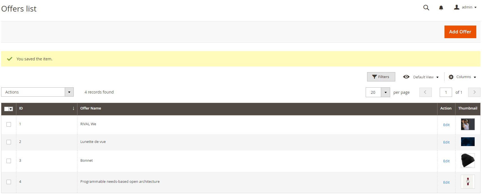
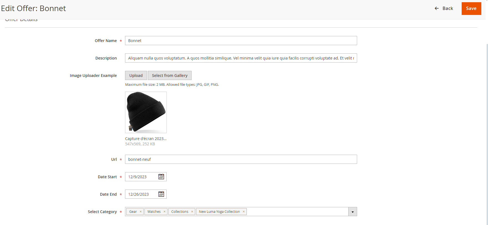

<h1 style="text-align: center;">DND OFFER - SLIDER OFFERS</h1>

## Installation

Installation is via `composer`

```
composer require apachethank/dnd-offer
```

After installing the packages just run:

```
php bin/magento setup:upgrade
php bin/magento setup:di:compile
php bin/magento setup:static-content:deploy
php bin/magento cache:flush

```

### Requirements:

* `PHP 7.4` and higher
* `Magento 2.4.x` and higher

### Tested on:

* `Magento 2.4.x` OpenSource

# Screens






